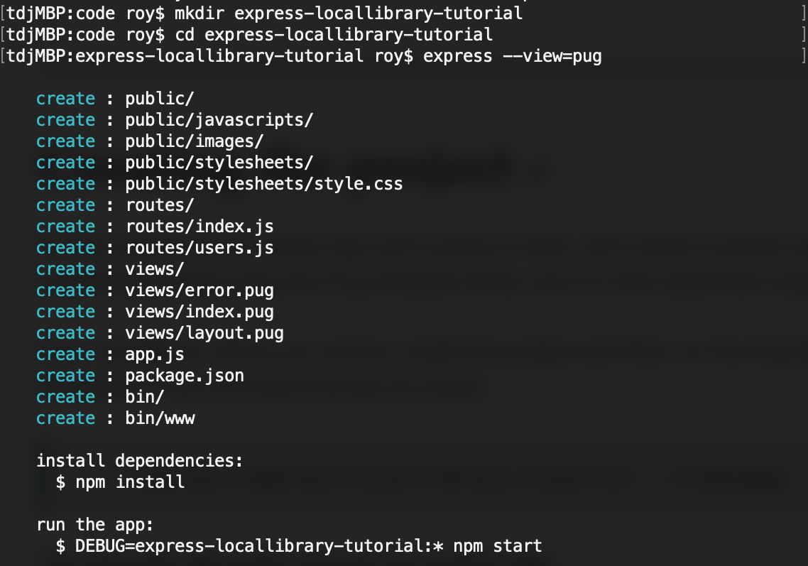

学习使用express-generator搭建express框架的web项目。<!--more-->

>在开始之前，本机已经安装并配置好 [node.js][node.js-download] 开发环境，安装步骤参考 [node.js安装教程][node.js-doc]。

## 安装express生成器


$ sudo npm install express-generator -g


直接运行 express 命令，将使用 Jade 视图引擎和纯 CSS 在当前目录中创建项目。


$ express


目录结构如下图：

还可以使用 --view 选择视图（模板）引擎，并且/或者使用 --css 选择 CSS 生成引擎。

## 运行项目

1 安装依赖


$ npm install


2 运行项目


$ npm start


项目默认会在本地3000端口运行，浏览器打开 http://localhost:3000/ 即可访问。

## 目录结构

- package.json - 定义了项目基础信息及依赖列表；其中 scripts 中定义运行项目的 npm 命令，默认为"start"。
- /bin/www - 应用入口文件。它 require 了根目录下的 app.js ，app.js会设置并返回 express 应用对象；port 设置当前应用运行端口。
- app.js - 创建一个 express 应用对象，通过各种设置选项和中间件来设置这个应用，然后从该模块中导出。
  1 引入一些实用 node 库
  
  var express = require('express');
  var createError = require('http-errors');
  var logger = require('morgan');
  var cookieParser = require('cookie-parser');
  var path = require('path');
  
  2 引入模板/文件用于处理路由（这些路由文件一般存放于 routes 文件夹）
  
  var indexRouter = require('./routes/index');
  var usersRouter = require('./routes/users');
  
  3 app.use() 把（之前导入的）路由处理器添加到请求处理链中
  
  app.use('/', indexRouter);
  app.use('/users', usersRouter);
  
  4 进行一些 http 请求的通用配置
  
  app.all('*',function (req, res, next) {
    res.header('Access-Control-Allow-Origin', '*');
    res.header("Access-Control-Allow-Credentials", "true");
    res.header('Access-Control-Allow-Headers', 'Content-Type, Content-Length, Authorization, Accept, X-Requested-With , yourHeaderFeild');
    res.header('Access-Control-Allow-Methods', 'PUT, POST, GET, DELETE, OPTIONS');
    res.header("X-Powered-By",' 3.2.1')
    if (req.method == 'OPTIONS') {
      res.send(200);
    }
    else {
      next();
    }
  });
  
- /routes/xxx.js - 配置路由，send() 或 sendFile() 定义响应内容
- /views 页面模板
- /public 存放css、js、resource等资源文件

[node.js-download]: https://nodejs.org/zh-cn/
[node.js-doc]:   https://developer.mozilla.org/zh-CN/docs/Learn/Server-side/Express_Nodejs/development_environment
